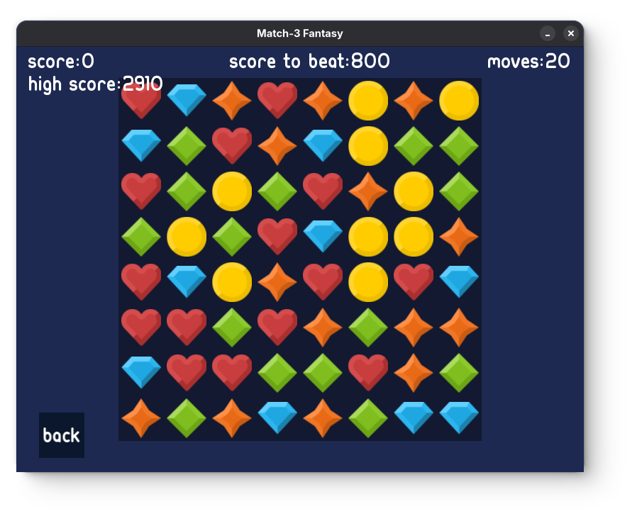

# Match-3 Fantasy

Match-3 Game made with SFML 2.6.2

## Index

- [Installation](#installation-and-execution)
  - [Windows](#for-windows)
  - [Linux](#for-linux)
- [How to Play](#how-to-play)

## Installation and Execution

### For Windows

Download `match-3-fantasy-win64.zip` then extract the folder and run `Match-3-Fantasy.exe`

### For Linux

First, install the SFML 2.6.2 dependencies

For **Debian** based distributions:

```bash
sudo apt install libsfml-dev
```

For **Arch** based distributions you need to install SFML from AUR:

```bash
yay -S sfml2
```

For **Fedora** based distributions:

```bash
sudo dnf install SFML-devel
```

Download `match-3-fantasy-linux.x86_64.zip` then extract it and run the `main.x86_64` file

## How to Play

Choose the play option and select a level, you must beat certain levels to get access to the other levels


When playing you select two gems that are next to each other. If you have 3 gems in a line, it's a match-3, and you score. You have a goal to achieve in order to beat the level and unlock the next level. You have a limited amount of movements to beat this goal.



If your match lines are made from 4 or more gems, you get a special gem that clears a big part of the gems on the screen, giving you a very high score.


In higher levels you will encounter blocks. These blocks are indestructible and cannot be moved.

